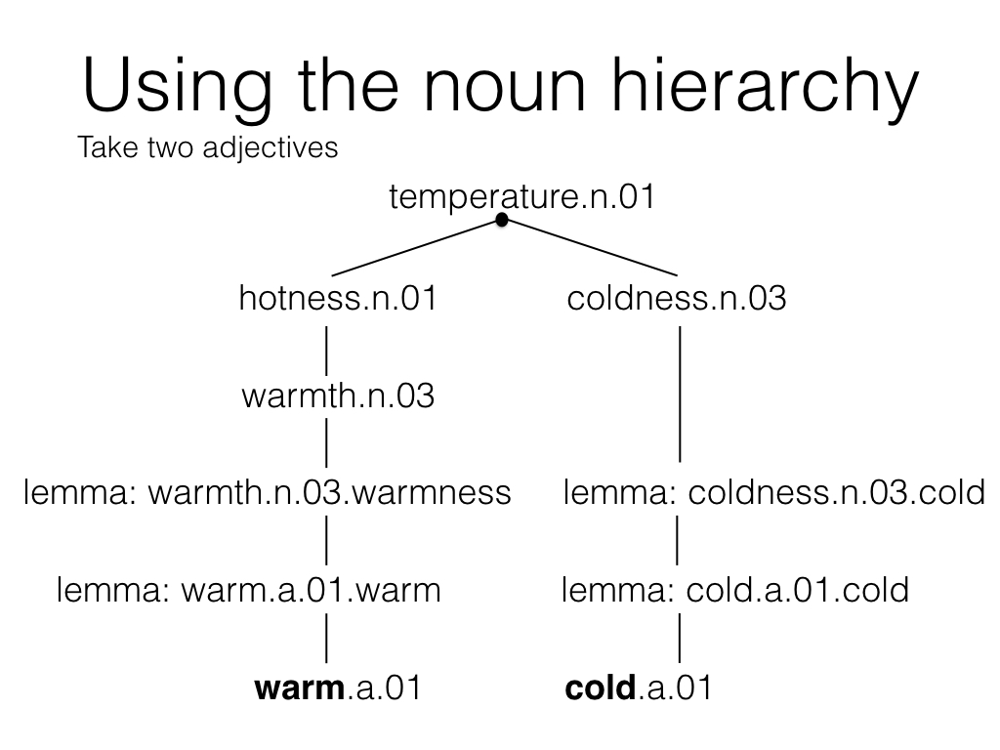

# gwc2016-adjective-similarity

This repository contains all the code for my GWC-2016 submission. Required python
modules are the following:

* matplotlib (for plotting)
* pandas (to package up the results and feed it to seaborn)
* tabulate (to generate results tables in LaTeX)
* seaborn (for making the plots prettier)
* numpy (for number crunching)
* scipy (for the spearman correlation)
* nltk (to load WordNet 3.0)

### Instructions for replication

1. Install all the required modules through conda or pip.
2. Download the vectors from [here](http://clic.cimec.unitn.it/composes/materials/EN-wform.w.5.cbow.neg10.400.subsmpl.txt.gz).
3. Run the scripts in any order on the command line, using `python SCRIPTNAME.py`.
   Output should be printed to the console (or saved to the images folder).
   I used python 3, but it should work on python 2.7.x as well.

### Animation

